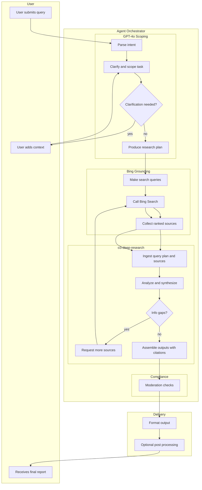
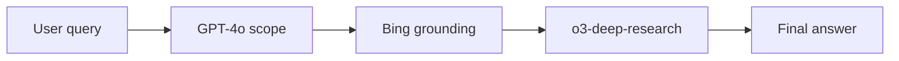
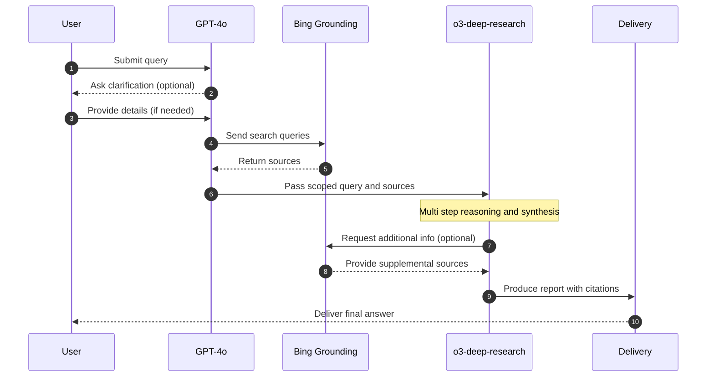

# Deep Research Pipeline in Azure AI Foundry

This document illustrates how the **Deep Research pipeline** works in Azure AI Foundry.  
It includes visualizations showing:  

1. **Detailed Flow (flowchart)** – full breakdown of stages and decisions.  

We'll use the example query:  
**"What is the impact of recent AI regulations on the financial sector?"**

---

## 1. Detailed Flow

**Example walkthrough:**  

- The user submits the query: *"What is the impact of recent AI regulations on the financial sector?"*  
- GPT-4o clarifies: identifies that this refers to regulations such as the EU AI Act (2023–2024) and U.S. SEC guidelines, and scopes the task to focus on their impact on banks, investment firms, and compliance costs.  
- Bing grounding is invoked to fetch recent articles, whitepapers, and regulatory summaries.  
- o3-deep-research ingests all sources, compares viewpoints (e.g., on compliance costs vs. innovation), resolves contradictions, and produces a structured report.  
- The report cites EU Commission press releases, financial industry analyses, and regulatory documents.  
- Optional compliance scanning ensures no sensitive or disallowed content leaks.  
- The formatted report is delivered back to the user or integrated into an internal workflow (e.g., a compliance dashboard).  

## 2. Simplified & Chronological Flow

This section merges the Simple User Flow and the Chronological Sequence.
It shows both:

A linear high-level flow of how data moves.

A time-ordered sequence of interactions between User, GPT-4o, Bing, and o3-deep-research.

## 2.1 Simple User Flow

Example walkthrough:

- User asks: “What is the impact of recent AI regulations on the financial sector?”

- GPT-4o clarifies that this refers to EU AI Act and SEC rules.

- Bing grounding retrieves fresh sources from government and industry reports.

- o3-deep-research synthesizes the findings into a polished report with citations.

- The user receives a final answer referencing specific regulations and industry impact.

## 2.2 Chronological Sequence

Example walkthrough:

- The user asks: “What is the impact of recent AI regulations on the financial sector?”

- GPT-4o clarifies, deciding to focus on EU AI Act and SEC guidelines.

- Bing grounding fetches official EU docs and industry analyses.

- o3-deep-research compares sources, notes conflicting views (e.g., on compliance cost), and may request additional SEC documents.

- The model produces a report with citations to EU and SEC sources.

- The user receives the final structured answer.

## Summary
This detailed flowchart shows the complete Deep Research pipeline in Azure AI Foundry, illustrating how user queries are processed through multiple AI agents to produce comprehensive, well-sourced research reports. The pipeline ensures accuracy through iterative grounding and maintains compliance through optional safety scanning.
